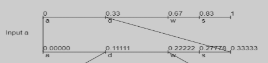
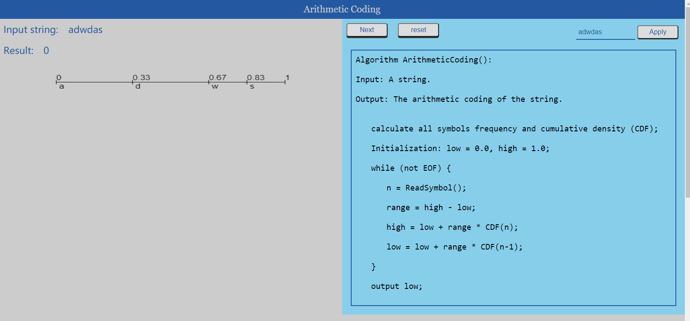
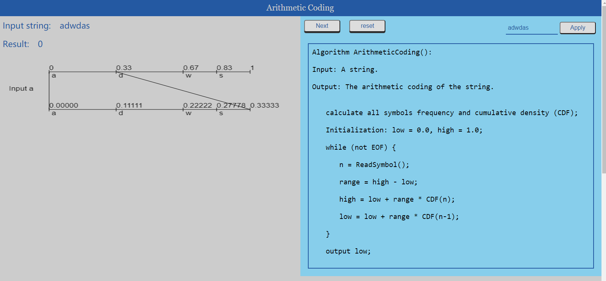
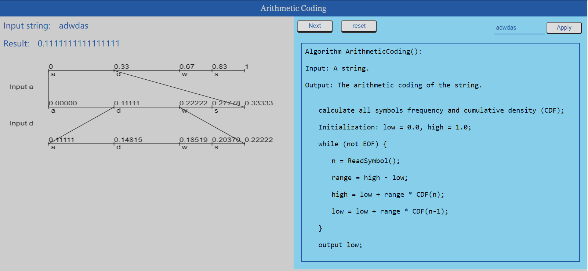
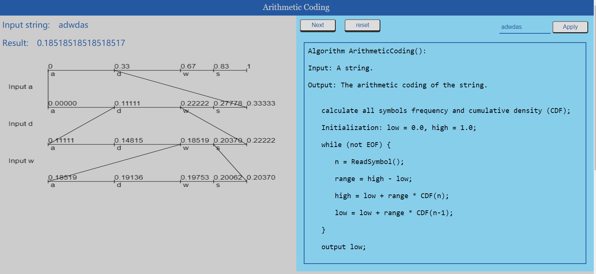
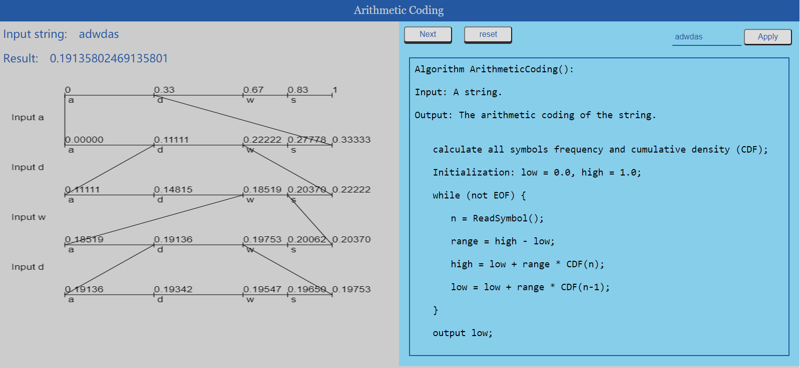
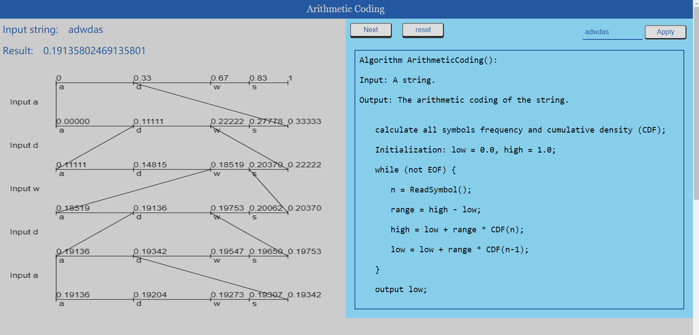

# Final Project Report

### Abstract

This is a project that using HTML5 Canvas to show the Arithmetic Coding algorithm, and it explains the algorithm using animation step-by-step. The project contains three main parts - HTML, CSS, and JavaScript. The HMTL page shows the result when execute the codes. The section on the top of the page is the algorithm's name that showing the user which algorithm is explaining. The left section is mainly used to show the animated graph of the arithmetic coding. The right section shows the algorithm in case the user does not see this algorithm before or want to compare it with the animated graph. The HTML page is decorated by the CSS file I wrote by myself. The CSS file is aim to make the HTML page more originated so that users can easily understand how to interact with the HTML page. The JavaScript files are the most important part in this project,  HTML5 Canvas is mostly controlled by JavaScript codes. It will be descripted in the later sections in detail.


### Introduction

In the past few years, more and more browsers gave up Flash, and turned to a new tool that also allows users to make animations - the HTML5 Canvas. HTML5 is much more convenient than Flash. It allows users to make animations by writing JavaScript codes, especially in recent ten years that all over the world is linked by Internet, browser becomes an indispensable tool in everyone's daily life. Therefore, this project is written by these front end languages - HTML, CSS, and JavaScript. In order to make the codes easier to be embedded, I didn't use any libraries like jQuery or Node.js. Since HTML is the only tool to show the results of the JavaScript codes, it is necessary to include a HTML page here. Moreover, to make the HTML page more organized and more clear, I also include a CSS file to decorate the page. 


Arithmetic coding is a lossless compression method, which is much more efficient than other lossless compression method. It  first start at a range of [0,1), and finds the encoding value recursively by shrinking the search interval. The difficult part is to recalculate all the threshold each time and draw them on the appropriate position. 


### Solution – describe the key steps of your solution; it can also include some subsections, e.g., system architecture, core algorithm, optimization, implementation, etc. 

##### Core algorithm

* Build up the cumulative density function (CDF)

  *  To implement the arithmetic coding, we first need to build a dictionary for each symbols in the input string, in which the key is the symbols, and values are the corresponding CDF values. 

  * Since JavaScript does not have a data structure same as dictionary, I use the most similar one, the Object. Object is a data type in JavaScript that contains keys and values. In this part, the most difficult problem is to calculate the last symbols CDF value, and we need it to  calculate the the CDF for each iteration except the first one. I came up with two methods, one use more memory but less running steps, the other one use less memory and more running steps. 

    * The method that use more memory but less running steps:

      In this method, I declare another variable "cumulative_temp" to keep track of the CDF values. It keeps the cdf in the last effective iteration. (Here "effective" means it adds a new key-value pairs to the cdf.)

      ```javascript
      var cdf = {};
      var scaned_string = '';
      var cumulative_temp = 0.0;
      for (var i = 0; i < input_string.length; i++) {
          if (i === 0) {
              cdf[input_string[i]] = get_frequency(input_string[i],
                                                   input_string);
              cumulative_temp = cdf[input_string[i]];
              scaned_string += input_string[i];
          }else{
              if (get_frequency(input_string[i], scaned_string) === 0){
                  cdf[input_string[i]] = cumulative_temp + get_frequency(input_string[i], input_string);
                  scaned_string += input_string[i];
                  cumulative_temp = cdf[input_string[i]];
              }
          }
      }
      ```

    * The method that use less memory and more running steps

      In this method, the trick is to use a property of the Object. The `Object.keys(cdf)` returns the keys in the Object `cdf` as an array. Thus, we can first get the last key in the keys array, it is the last inserted cdf element, so by this key we can get the last added cdf value. 

      ```javascript
      var cdf = {};
      var scaned_string = '';
      for (var i = 0; i < input_string.length; i++) {
          if (i === 0) {
              cdf[input_string[i]] = get_frequency(input_string[i], input_string);
              scaned_string += input_string[i];
          }else{
              if (get_frequency(input_string[i], scaned_string) === 0){
                  cdf[input_string[i]] = cdf[Object.keys(cdf[(Object.keys(cdf)).length-1]] + get_frequency(input_string[i], input_string);
                  scaned_string += input_string[i];
              }
          }
      }
      ```

##### Draw the animation

* To draw the graph, there are three main functions and two tricks used in the codes. 

  

  * Three functions - As we can see from the graph above, it can be divided into three parts:

    * An axis that shows the range of the current searching interval - `function draw_axis()`
    * Some bars to divide the axis into serval parts based on the CDF values - `function draw_bar()`
    * Two lines that link the two neighboring axies (get from two adjacent iteration), which shows the process of enlarge the axis to search on a more precise level - `draw_line()`

  * Two tricks to make the graph more clear and easier to understand:

    * Deal with unclear contents in HTML5 Canvas - Canvas are showing blur contents for Retina screens. The reason is that shapes in canvas are not vector based, high dpi display screens means there are more pixels in every unit size, so the browser will display the one original pixel by two or more pixels, in this case, the shapes on the canvas will become blur. To fix this, I searched serval websites and get a result: we need to get the screen resolution for different screens and rescale the canvas by this resolution ratio. The main codes are shown below:

      ```javascript
      var getPixelRatio = function (context) {
          var backingStore = context.backingStorePixelRatio ||
              context.webkitBackingStorePixelRatio ||
              context.mozBackingStorePixelRatio ||
              context.msBackingStorePixelRatio ||
              context.oBackingStorePixelRatio ||
              context.backingStorePixelRatio || 1;
          return (window.devicePixelRatio || 1) / backingStore;
      };
      var canvas = document.getElementById("tree");
      var ctx = canvas.getContext("2d");
      var ratio = getPixelRatio(ctx);
      
      canvas.width = canvas.width * ratio;
      canvas.height = canvas.height * ratio;
      canvas.style.width = '100%';
      canvas.style.height = canvas.height + 'px';
      
      ctx.scale(ratio,ratio);
      ```

    * Another trick is to calculate the lines positions for the lines that link two adjacent axis. This is a difficult part in this project. I tried several methods, such as re-calculating the `high` and `low` in previous iteration. However, these methods either cannot satisfied the time efficiency or the space efficiency. Eventually, I came out of a relatively efficient method, to store the corresponding starting and ending values in the previous iteration. The formulas is shown below:

      ```javascript
      // it's the first iteration, there's no previous iteration, so calculate them directly
      last_high = (x2-x1) * cdf[input_string[j]] + x1;
      last_low = x1;
      
      // not the first iteration but encounter the first symbol encoded in the CDF
      last_high = (x2-x1) * cdf[input_string[j]] + x1;
      last_low = x1;
      
      // other situations
      last_high = (x2-x1) * cdf[input_string[j]] + x1;
      last_low = (x2-x1) * cdf[last_value] + x1;
      ```

### The most difficult problem

The most difficult problem is to link the JavaScript code and HTML elements in a way that user can interact with the code (break, continue, start, stop, etc.).

Here are some traps that I have ever encountered. 

##### Traps

I tried to implement the interactions in a loop. The way is that the button onclick event is in a loop, I hope that every time I click the button, the loop will run one iteration. However, the result is that when I click the button, the program only show the last step of the animation, so this method failed. 

Another method I tried is to split the arithmetic encoding function in a way that one function only build up the CDF dictionary, and the other one do the encoding and draw the graph simultaneously (Since these two process are happen together on each step, it's inefficient if we split them, even though the software engineering coding standards specify that one function only do one thing. ) Thus, the CDF building up function only need to run once, and the encoding-and-drawing function run once for each button click event. However, the problem here is that the encoding-and-drawing function creates a refresh the canvas every time it has been run, so the result is that only the last step showed on the canvas in the end. 

##### Succeed method

The method really successfully animated the whole process is the third method I tried here. Give a length to the `arithmetic()` function, the length is the iteration counters, i.e. the loop iterates "length" times, then stop. Thus, even if the canvas is refreshed every time, the graph re-draw the previous part, so the whole graph can always shows on the screen to avoid misunderstanding by new students who don't familiar with the algorithm. 

This method still has some drawback. For example, The graph is re-drawed  for every button click event. If the string is short, the running time has almost no difference with no-redraw programs, but if the string is very long, then redraw the graph every time is quiet time consuming. 

Another trick I would like to mention here is the iterator for the loops. I stored it at a HTML element with height 0, which not effect the user experience, but it's not secure - User can get the hidden data if they check the source code for the HTML file (It is quiet to see the front end codes, most browsers allow users to loop up the source codes by just click a shortcut key). The iterator in this program is not that important, but if it's some private information, it will be very dangerous to store information in this way. 


##### Other efforts

I also put some effort on build up HTML page and use CSS to decorate the page, but it's not important in this project, so I briefly list them in this section. 

*  Show "coding-like" algorithm on the HTML page.
* Divide each section by a pair of `<div>` tag so the HTML code is clear and easy to understand.
* Given buttons some effects so that it's animated as a real button input.
* Set each section in an appropriate way by using `float` method in CSS.
* Put all relevant CSS  selector together so that it's convenient for later finding and fixing some properties.  

# Sample Output

To interact with this HTML page, user need to follow these steps:

1. Input a string in the input text box;
2. Click "Apply" button, the input string will display at the top left after "Input string: ";
3. Click "Next" for several times until the graph not updating;
4. The result showed on the top left corner after "Result: " is the Arithmetic encoding of the input string;
5. Click the reset button if user want to type another string.

The screenshots shown below are the step by step animation for encoding the string "adwdas":














# Reference 

HTML CN (2018, May 12). Solve the Problem of Canvas Blur in DIP screens .* https://www.html.cn/archives/9297

